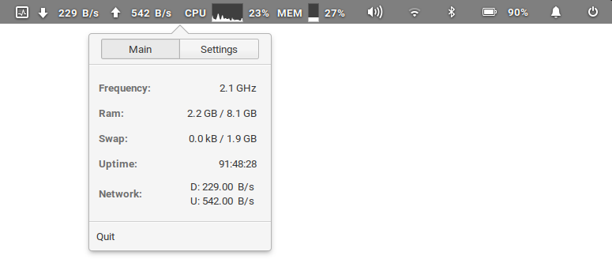
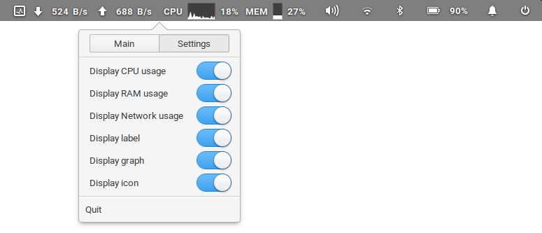

# Wingpanel System Monitor Indicator

I recommend to switch to the [new implementation](https://github.com/PlugaruT/wingpanel-monitor) of this indicator as I do not plan on working on this one anymore.




## Building and Installation

You'll need the following dependencies:

```
libglib2.0-dev
libgtop2-dev
libgranite-dev
libgtk-3-dev
libwingpanel-2.0-dev
meson
valac
```

## Elementary

```
sudo apt install libgtop2-dev libgranite-dev libgtk-3-dev libwingpanel-2.0-dev meson valac
```

Run `meson` to configure the build environment and then `ninja` to build

```
meson build --prefix=/usr
cd build
ninja
```

To install, use `ninja install`

```
sudo ninja install
```

## Arch Linux
Arch Linux users can find Wingpanel Indicator Sys Monitor under the name [wingpanel-indicator-sys-monitor-git](https://aur.archlinux.org/packages/wingpanel-indicator-sys-monitor-git/) in the **AUR**:

`aurman -S wingpanel-indicator-sys-monitor-git`

### Notes

 - Special thanks for [@RyanDam](https://github.com/RyanDam/) for the graph implementation!
